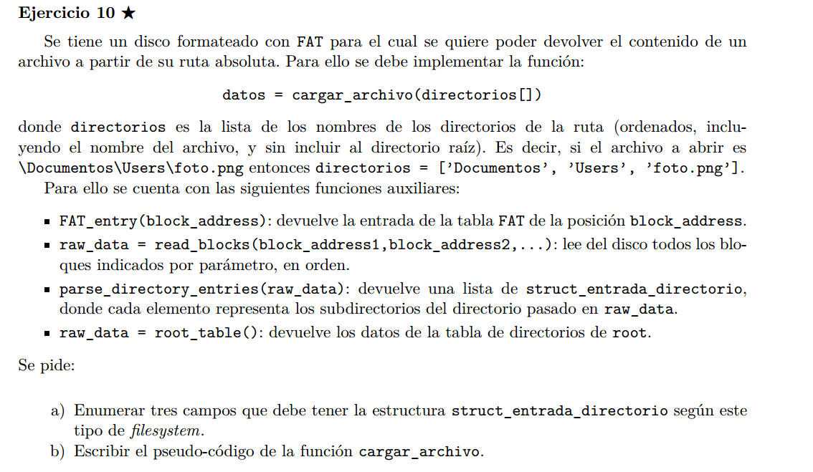

## a)

1. starting_block_address
1. name
1. type (para saber si es archivo comun o directorio)


## b)

```C++

char* cargar_directorios(vector<string> directorios){

    vector<directory_entry> dir_entries = parse_directory_entries(root_table())
    char* raw_data

    for(int i=0; i<directorios.size; i++){
        // busqueda de dir[i]
        directory_entry dentry
        for(d : dir_entries)
            if d.name = directorios[i] 
                dentry = d
                break

        // juntamos las direcciones de blockes de datos de la dentry
        vector<block_adress> v_addres;
        FAT_entry fentry = FAT_entry(dentry.starting_block_adress)
        v_adress.push_back(dentry.starting_block_adress)

        while(fentry.next_block_address != EOF)
            v_adress.push_back(fentry.next_block_address)
            fentry = FAT_entry(fentry.next_block_address)

        // nos traemos la data de los bloques de datos de la direntry
        raw_data = read_blocks(v_adress)

        // parseamos el directorio (si lo era) para la siguiente busqueda
        if(dentry.type = "directory")
            dir_entries = parse_directory_entries(raw_data)

        // asumo que podemos llegar a un match con un archivo solo en la ultima iteracion
    }

    return raw_data;
}

// hay que recorrer todas las entradas de root, hasta encontrar
// dir[0]
// luego, hay que recorrer todas las entradas de dir[1],
// hasta encontrar la entrada de dir[2]
// asi, hasta llegar a dir[n-1] luego devuelvo su raw data.

```