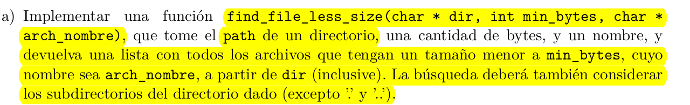
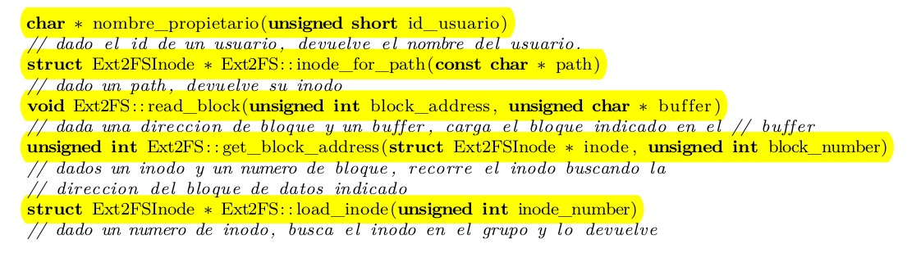
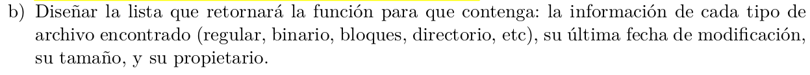

```C

void find_file_less_size_aux(ExtFSInode inode, int min_bytes, char* arch_name, vector<ExtFSInode> res){

    int cluster_size = inode.size;
    int cant_bloques = cluster_size/BLOCK_SIZE

    for(int i=0; i<cant_bloques; i++){
        // asumo que el block_number que toma get_block_address, es el numero de block
        // dentro del cluster de bloques de data del inode.
        int address = get_block_address(i)
        char* block_buffer = malloc(BLOCK_SIZE)
        read_block(address, block_buffer)

        int block_offset = 0;
        int j = 0;

        // skipeamos las 2 primeras dir entries (.) y (..)
        if(i == 0) j += 2 * sizeof(ExtFSDirEntry)

        // ahora recorremos todas las dir_entries de este bloque
        while(j < BLOCK_SIZE){

            ExtFSDirEntry* dentry = ((ExtFSDirEntry*)block_buffer) + block_offset
            if get_info(dentry.mode) == "file"
                if(arch_name == dentry.name && dentry.inode.size < min_bytes)
                    res.push_back(dentry.inode);

            if get_info(dentry.mode) == "directory"
                find_file_less_size(dentry.inode, min_bytes, arch_name, res)

            block_offset += dentry.record_lenght
            j += dentry.record_lenght
        }
    }
} 


vector<ExtFSInode> find_file_less_size(char* dir, int min_bytes, char* arch_name, vector<ExtFSInode> res){

    vector<char*> res;
    Ext2FSInode inode = inode_for_path(dir)
    find_file_less_size_aux(inode, min_bytes, arch_name, res)
    return res
}

```


b)
    


Podemos hacer que sea una lista de structs, donde cada struct tiene los campos pedidos.

c) ¿Qué problemas podrían ocurrir al hacer la búsqueda del item anterior si consideramos también
los enlaces simbólicos?

Hasta ahora veniamos asumiendo que no habia links, si los hubiese, entonces podriamos quedarnos
en un loop infinito en los llamados recursivos de busqueda en directorios, ya que en lugar
de tener forma de arbol el file directory, podria tener forma de grafo con loops.