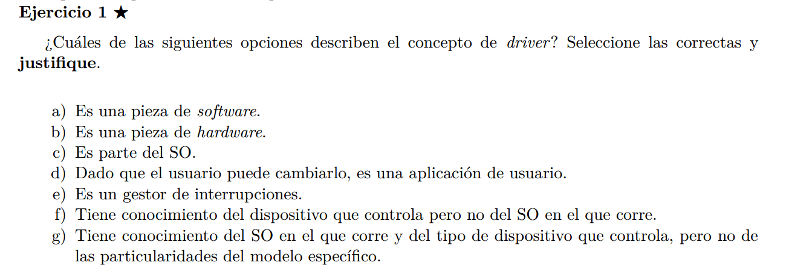

Las correctas son a, d, e:  
El driver es una pieza de software que sirve como intermediario entre el sitema operativo y una pieza de hardware (mouse, teclado, etc). Este puede ser visto como un integrante del sistema operativo (aunque no forma parte de el por defecto), aunque si es cierto que los SSOO suelen 
proveer una serie de drivers genericos de fabrica (para mouse, pantalla, audio o taclado), pero los drivers para hardware especifico, por ejemplo para una tarjeta grafica nvidia, no vienen por default en un SO.  

Los drivers se encargan de gestionar las interrupciones que pueden llegar a generar los dipositivos que estos controla, por ejemplo los teclados.  

Los drivers tienen que tener conocimiento especifico del dispositivo que controlan y de su modelo tambien, por eso hay drivers especificos para diferentes modelos de tarjetas graficas. 

