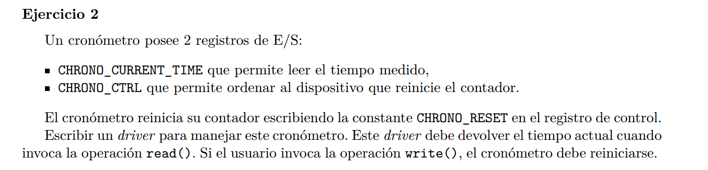
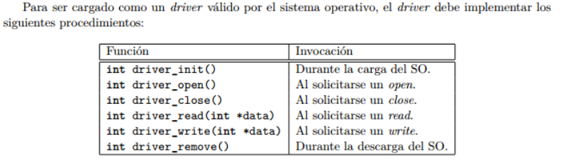

Tenemos que implementar los siguientes procedimientos:


```C

int driver_write(int *data){
    // para reinicial el coronometro

    sema_wait(&mutex);
    OUT(CHRONO_CTRL, CHRONO_RESET);
    sema_signal(&mutex);

    return IO_OK;
}


int driver_read(int *data){
    // para consultar la hora

    int hora = IN(CHRONO_CURRENT_TIME);
    copy_to_user(data, &hora, sizeof(hora));
    return IO_OK;
}

int driver_init(){
    sema_init(&mutex, 1);
    return IO_OK;
}


```