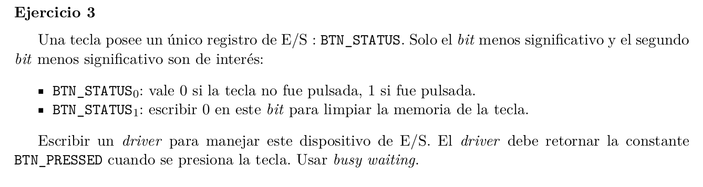

Es una sola tecla, y usamos polling.

```C

# define BYTE_0 (X) (X | 0x00000001)
# define BYTE_1 (X) (X | 0x00000002) 

// esta funcion al ser llamada, espera a que el boton sea presionado, luego retorna por data,
// BTN_PRESSED 

int driver_read(int *data){

    sem_wait(&mutex);
    int status;
    while(!(status = (IN(BTN_STATUS) & 0x00000001))){} // polling

    // reseteamos el boton
    OUT(BTN_STATUS, status & 0xFFFFFFFC); 
    sem_signal(&mutex);

    int res = BTN_PRESSED;
    copy_to_user(data, &res, sizeof(res));

    return IO_OK;
}


```