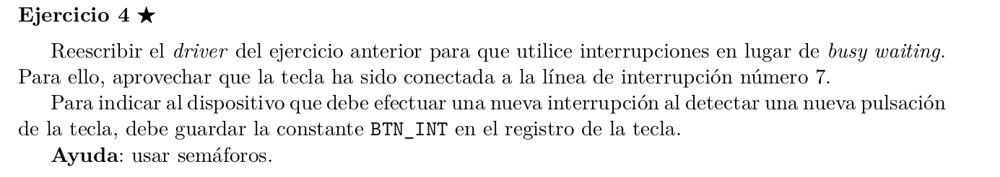

```C 

int driver_read(int *data){

    sem_wait(&mutex);

    sem_wait(&listo);

    // reseteamos el boton
    int reset_val = BTN_INT;
    OUT(BTN_STATUS, reset_val); 
    sem_signal(&mutex);

    int res = BTN_PRESSED;
    copy_to_user(data, &res, sizeof(res));

    return IO_OK;
}


int driver_init(){
    sema_init(&acceso, 1);
    sema_init(&listo, 1);
    request_irq(INT7, handler);
    return IO_OK;
}

int driver_remove(){
    free_irq(INT7);
    return IO_OK;
}

void handler(){
    sema_signal(&listo);
}


```