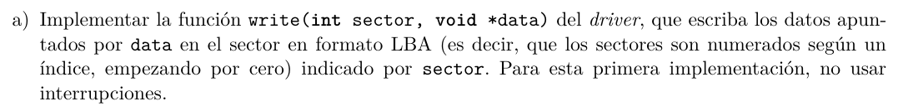
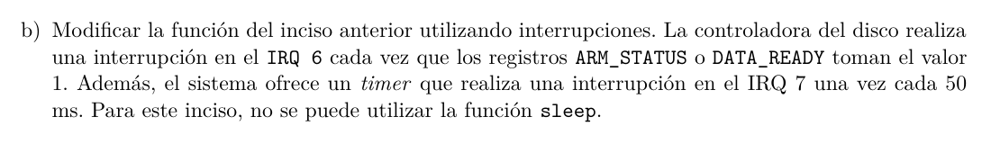

```C
int write(int sector, void* data){

    sema_wait(&mutex);

    // check motor encendido
    if(IN(DOR_STATUS == 0)) OUT(DOR_IO, 1);
    sleep(50ms);

    // seleccionamos pista y sector
    int pista = sector / cant_sectores_por_pista();
    OUT(ARM, pista);
    while(IN(ARM_STATUS) =! 1);
    OUT(SEEK_SECTOR, sector);

    // escribimos en el ultimo sector seleccionado
    int* kdata;
    copy_form_user(kdata, data, sizeof(data));
    escribir_datos(kdata);

    // esperamos a que termine la escritura
    while(IN(DATA_READY) != 1);

    // al final, apagamos el motor
    OUT(DOR_IO, 0);
    sleep(200ms);

    sema_signal(&mutex);

    return IO_OK;
}

int driver_init(){
    sema_init(&mutex, 1);
    return IO_OK;
}

```




```C

bool skip_timer;
semaphore mutex, sem_arm, sem_status;

int write(int sector, void* data){

    sema_wait(&mutex);

    // check motor encendido
    if(IN(DOR_STATUS == 0)) OUT(DOR_IO, 1);
    skip_timer = false
    for(int i=0; i<2; i++) sema_wait(&sem_timer);
    skip_timer = true;

    // seleccionamos pista y sector
    int pista = sector / cant_sectores_por_pista();
    OUT(ARM, pista);

    sema_wait(&sem_arm);

    OUT(SEEK_SECTOR, sector);

    // escribimos en el ultimo sector seleccionado
    int* kdata;
    copy_form_user(kdata, data, sizeof(data));
    escribir_datos(kdata);

    // esperamos a que termine la escritura
    sema_wait(&sem_status);

    // al final, apagamos el motor
    OUT(DOR_IO, 0);
    skip_timer = false;
    for(int i=0; i<5; i++) sema_wait(&sem_timer);
    skip_timer = true;

    sema_signal(&mutex);

    return IO_OK;
}

int driver_init(){
    skip_timer = true;

    sema_init(&mutex, 1);
    sema_init(&sem_arm, 0);
    sema_init(&sem_status, 0);

    request_irq(IRQ6, handler_status);
    request_irq(IRQ7, handler_timer);

    return IO_OK;
}

void handler_status(){


}

void handler_timer(){
    if(!skip_timer) sema_signal(&sem_timer);
}

int driver_close(){
    free_irq(handler_status);
    free_irq(handler_timer);
}


```