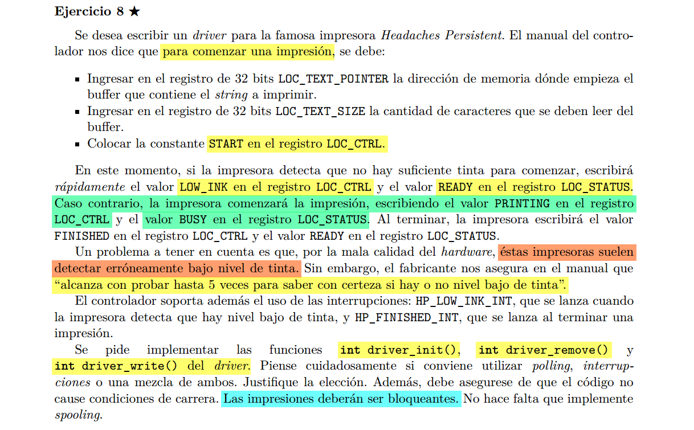

Asumo que la impresora solo puede darse cuenta de que le falta tinta tras 
un intento fallido de impresion.


```C

semaphore mutex, sem_finished;

int driver_write(char* udata, unsigned int size){

    // asumo q si este mutex esta abierto, entonces LOC_STATUS = READY

    sema_wait(&mutex);

    // por las dudas, habria que esperar a que este en READY?

    char* kdata = kmalloc(size);
    copy_from_user(kdata, udata, size);

    OUT(LOC_TEXT_POINTER, kdata); // una direccion de 32 bits (4B)???
    OUT(LOC_TEXT_SIZE, size);
    OUT(LOC_CTRL, START);

    while(IN(LOC_CTRL) == START);

    // aca puede ser que nos avisen que no hay tinta

    if(IN(LOC_CTRL) == LOW_INK)
        for(int i=0; i<5; i++)
            OUT(LOC_CTRL, START);
            while(IN(LOC_CTRL) == START);
            if(IN(LOC_CTRL) == BUSY) break;

    // si tras las 5 verificaciones sigue sin tinta... Hacemos polling, ya que
    // no tenemos una interrupcion que nos avise cuando le recargaron la tinta.
    // o cuando la impresora comienza.
    while(IN(LOC_CTRL) == LOW_INK);

    // si pasa, ya esta imprimiendo: LOC_CTRL = BUSY, LOC_STATUS = PRINTING

    // al final: LOC_CTRL = FINISHED y LOC_STATUS = READY

    sema_wait(&sem_finished);
    kfree(kdata);

    sema_signal(&mutex)

    return IO_OK;
}

int driver_init(){
    // request_irq(HP_LOW_INK_INT, hander_low_ink);
    request_irq(HP_FINISHED_INT, hander_finished);

    return IO_OK;
}

void handler_low_ink(){
}


void handler_finished(){
    sema_signal(&sem_finished);
}


int driver_remove(){
    // free_irq(HP_LOW_INK_INT);
    free_irq(HP_FINISHED_INT);
    
    return IO_OK;
}


```