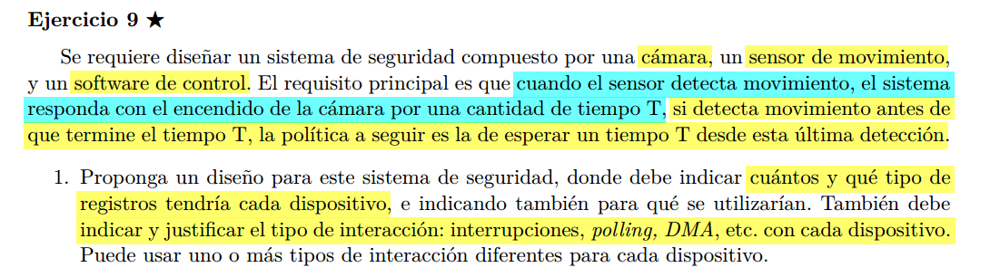

```C
// Para el sensor
Registros:
SENS_STATUS: true: detecto algo en los ultimos T segundos, sino false.
SENS_T: guarda la duracion del intervalo de encendido.


operaciones:
read(): para que nos diga si senso algo en el ultimo intervalo T, cada vez q leemos, limpiamos.
write(): para mandarle la configuracion de T inicial.

// Para la camara
Registros:
CAM_STATUS : ON / OFF


en CAM_T esta el valor configurable del intervalo de tiempo que se mantiene encendida la camara.
Para encender/apagar la camara escribimos en CAM_CTRL, los valores ON/OFF.


El software de control va a manejar ambos dispositivos usando las operaciones implementadas en los drivers como se describe a continuacion:

Contantemente le vamos a preguntar al sensor si en el ultimo intervalo T detecto algun movimiento. De ser asi, vamos a mantener prendida la camara, sino la apagamos. 

El sensor guarda en SENS_STATUS, el valor true/false, dependiendo si en el ultimo intervalo de 

Si detecto algo en los ultimos T segundos, enciende la camara y se manda un sleep, tras el sleep. 
Si no detecto nada, entonces apaga la camara.

```

```C

int read_s(int* udata){
	int kdata = IN(SENS_STATUS);
	int val = NO_MOVEMENT;
	OUT(SENS_STATUS, NO_MOVEMENT);
	copy_from_user(&kdata, udata, sizeof(kdata));
	return IO_OK;
}

int write_s(int* udata){
	int kdata;
	copy_from_user(&kdata, udata, sizeof(kdata));
	OUT(SENS_T, kdata);
	return IO_OK;
}

int write_c(int* udata){
	int kdata;
	copy_from_user(&kdata, udata, sizeof(kdata));
	OUT(SENS_T, kdata);
	return IO_OK;
}

```


```C
sistema general


int OFF = 0
int ON = 1

void main() {
	int camara = open("/dev/camara");
	int sensor = open("/dev/sensor");

    int T;
	scanf(&T)

	//Configuramos el sensor
	write(sensor, T, sizeof(T));
	while(1){
		int mov;
		read(sensor, &mov, sizeof(mov)); // cada vez que lo leemos, lo reseteamos
        if(mov == MOVEMENT){
            write(camara, ON)
            sleep(T)
        }
        else write(camara, OFF)
	}
}

```