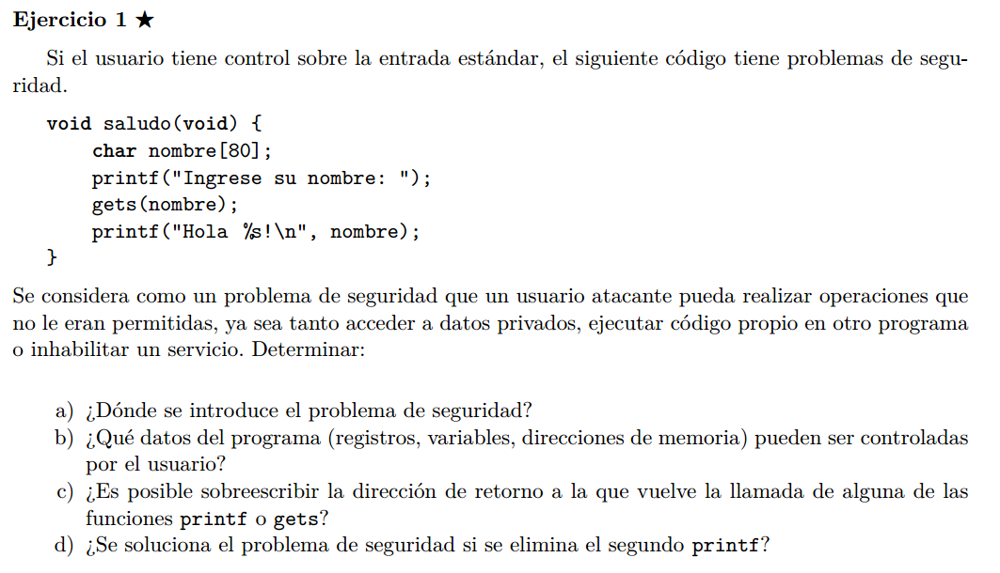

## a)
El problema esta en que le damos libertad al usuario para que introduzca un string de
cualquier longitud en un buffer de tamanio fijo.  
La funcion gets() lee el input y escribe en el buffer hasta que se topa con un "\n"
o un "\0", si esto no ocurre antes que se acabe el espacio del buffer, vamos a seguir
escribiendo en posiciones de memoria fuera de rango, causando un buffer overflow.

## b)
El usuario podria pisar regiones de memoria que estuviesen por debajo (direcciones mas altas)
de la region de buffer, afectando regiones del stack de cosas que fueron pusheadas antes que el buffer.  
Podria afectar otras variables temporales, la direccion donde guardamos el RBP de la funcion llamadora 
y hasta la direccion donde tenemos el RIP (dir de retorno).

En este caso, todo el espacio (80 B) de variables temporales esta ocupada por el array de chars.


## c)
No, ya que estas se pushearon despues (direcciones menores) de la region de memoria de buffer,
y al escribir en un buffer con gets, se escriben primero las direcciones mas bajas y luego las mas altas.

## d)  
No, el printf solo lee la memoria, no la escribe. El problema se soluciona usando  
```fgets(&nombre, sizeof(nombre); stdin)``` , que pide como
segundo parametro un size limite para leer (para que no se pase del size del buffer).


