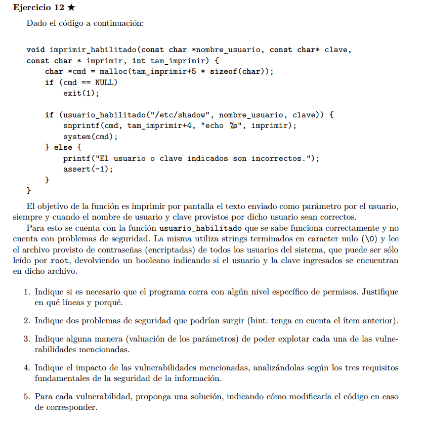

## a)  

Asumo que la funcion usuario_habilitado esta definida (inlcuida) en el mismo archivo que 
imprimir_habilitado.

En este caso, ya que usuario_habilitado necesita poder leer el contenido de /etc/shadow, va
a necesitar permisos de root.

Estos los podemos obetener si un usuario root, setea el campo de suid a este file.


## b) c)

1. Un usuario habilitado (no necesariamente root) podria obtener privilegios root usando
format strings:

```C
// obtenemos una terminal root.
imprimir = "Hello; /bin/sh"
```
Esto ya que no se sanitiza el mensaje a imprimir.


2. Notemos que vamos a llamar a echo no desde una ruta absoluta, por lo tanto, podriamos cambiar el PATH para que busque el binario de echo en una ruta que elijamos nosotros y ahi, 
podriamos crear un ejecutable malicioso con el mismo nombre echo, logrando asi ejecutarlo con 
privilegios root!


## d)   
Se violan los 3 requisitos fundamentales, si un usuario no root obtiene privilegios root:

Confidencialidad: Puede ver passwords.
Integridad: Puede cambiar archivos que no tendria permiso normalmente.
Disponibilidad: Puede borrar archivos y dejar el sistema inutilizable.

## e)
1. Podemos sanitizar el input de usuario para que no tenga caracteres peligrosos. Para esto podemos usar regex o strtok.

2. Podemos usar rutas absolutas, por ejemplo ```/usr/bin/echo <params>```.

