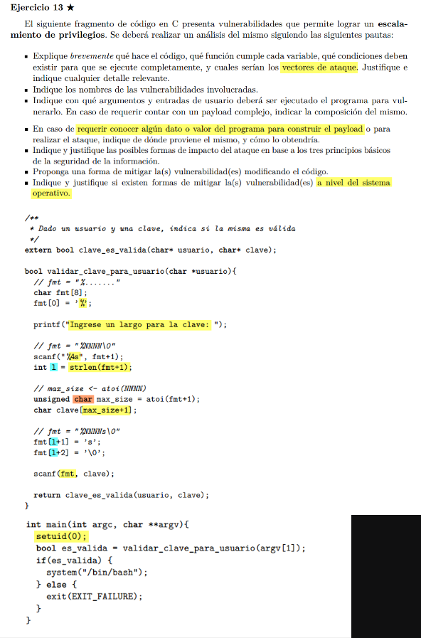
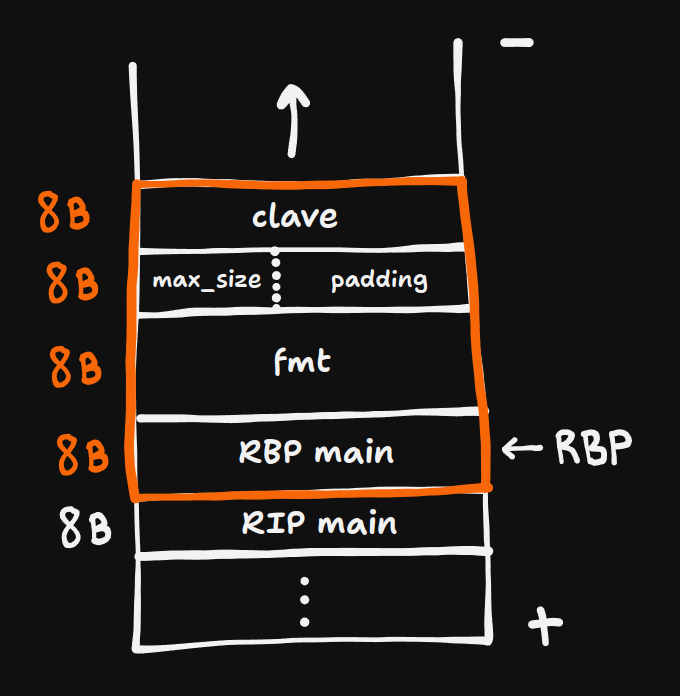

## a)  
El codigo es de un progama que le pide los datos al usuario (usuario y password), y si estos son validos, se abre una terminal con privilegios root.  

El programa se llama por terminal, pasandole como parametro el nombre de usuiario (string), este usuario es el que se le pasa a la funcion
``` clave_es_valida```. Esta ultima, le pide al usuario que ingrese 2 cosas por stdin:
1. El largo de la clave.
2. La clave.

El ```largo de la clave``` se usa en la variable ```fmt```, la cual es el format string que vamos a usar en scanf para leer la clave que nos va a escribir el usuario por stdin.

## Vulnerabilidades:

Darle libertad al usuario para que cree (parcialmente) la format string que le damos a scanf no es una buena idea, podriamos leakear datos del stack si la format string nos queda: ```"%x %x" ```, o podriamos tratar de leer cachos mas grandes del stack como si
fuesen strings con ```"%s %s"```, lo cual podria causar un seg fault si leemos una posicion de memoria que no debiamos.

Notemos tambien que ```max_size``` es un char, osea que solo puede representar valores hasta 255, pero le permitimos al usuario ingresar una longitud de clave de hasta 4 digitos, osea hasta 9999. Por lo tanto podemos poner una longitud mayor a 255 y ```max_size``` va a wrapear a 0 devuelta y seguir contando.  
Entonces clave[] va a poder alvergar hasta 255 chars, pero por scanf grancias a ```fmt```, vamos a poder leer claves mucho mas grandes, vamos a ser vulnerables a buffer overflow.

## buffer overflow:  
```bash
./programa "pepe" 
262
payload
```

donde ```payload = AA...AA (32 veces) + dir```

donde ```dir``` es una direccion con la que vamos a pisar el RIP.
Me gustaria que fuese la direccion donde esta la instruccion ```system("/bin/bash");```.




Asi es como tenemos el stack justo antes de ejecutar la linea ```scanf(fmt, clave);```, notemos que como seteamos el largo de la clave a 262, el valor de ```max_size``` va a wrappear a 7, luego nos queda ```clave[8]```.  
Luego cuando ingresamos la clave, los primeros 32 B pisan la parte naranja de stack y a lo ultimo podemos poner una direccion de memoria (codificada en ascii), a la que querramos saltar.

## foras de mitigar
En lugar de darle control al usuario para poner la longitud de la clave, podemos setear una longitud maxima nosotoros e informarsela al usuario. Siempre que le pedimos input a un usuario debemos considerarlo sucio y sanitizarlo. 

```C
int MAX_LENGHT = 30;

// en validadr_clave_para_usuario()
char clave[MAX_LENGTH + 1];
printf("ingrese la clave");
scanf("%30s", clave);
...

```

Ademas para evitar overflow (o underflow) hay que usar ```size_t``` para guardar sizes.


A nivel del sistema, podriamos usar stack canaries para asegurarnos de que el stack no fue manipulado antes de hacer el return de una funcion.


## DUDA:
Al pisar el stack con el buffer overflow, estamos pisando la direccion donde teniamos el RBP, en el epilogo de la funcion, antes de hacer el return, no nos va matar un seg fault si cambiamos el RBP a cualquier basura????