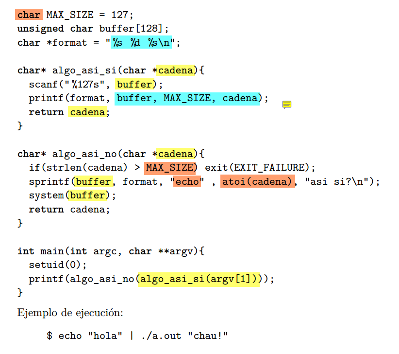

## Descripcion

Este programa se llama por terminal pasandole de entrada un string como parametro, el programa usa setuid para tener privilegios elevados.

El progarma primero llama a la funcion ```algo_asi_si()```, la cual toma como parametro el string que pasamos por terminal y lo guarda en ```cadena```. 
Luego, en la funcion, se le pide al usuario un string para llenar la var globar ```buffer``` (notar que el tam maximo esta dado por MAX_SIZE),
luego la funcion printea 2 strings con un numero en el medio, siguiendo el formato dado por la format string ```ftm```.
Por ultimo, retornamos la misma ```cadena``` que nos pasaron como parametro.

Luego en el main, la cadera retornada por ```algo_asi_si()``` (sin modificar), se la pasa de entrada a ```algo_asi_no()```, aqui se verifica que la long de la cadena no se pase del maximo. Si la long esta en orden, se procede a armar un comando a ejecutar por ```system``` en ```buffer```.  
El comando tiene la pinta:

```bash
echo atoi(cadena) "asi si?\n"
```

En donde atoi convierte (o lo intenta) la cadena a numero entero base 10.
Recordemos que este compando se va a ejecutar con privilegios elevados!

Por ultimo retornamos ```cadena``` otra vez sin modificar para que sea printeada con ```printf``` desde el main.


## vulnerabilidades :

### variables de entorno:
Esta es la mas peligrosa a mi parecer, ya que nos permite obtener una terminar root (somos admin 😎).  

Notemos que en el mensaje que le damos a ```system``` estamos llamando a ```echo``` no con la ruta completa, asi que un atacante podria modificar el path para que busque el binario de ```echo``` en una ruta especifica, en donde podria crear otro script con el mismo nombre, para que el sistemas lo ejecute con privilegio elevado!  
Por ejemplo:

```bash
echo -e "!# /bin/sh \n /bin/bash" > /tmp/echo
chmod +x /tmp/echo

# que busque primero en /tmp
export PATH = "/tmp:$PATH"

# listo, con solo llamar al programa (como antes) vamos a correr nuestro script que nos va a dar una terminal root!
```
Una solucion para este problema es usar siempre rutas absolutas:
```/usr/bin/echo``` en lugar de solo ```echo```

<!-- ### buffer overflow
La variable globar buffer tiene un size fijo de 127 (el maximo numero que se puede representar con un signed char). Pero le permitimos al usuario escribir una ```cadena``` de hasta 126 bytes (chars). Notemos que en ```sprintnf``` estamos guardando lo printeado en ```buffer```. Por lo tanto (debido al formato) va a tener la pinta:  
```bash
buffer = "echo <numero> asi si?\n\n"
```
Sabemos que podemos meter 127 chars en ```buffer```, haciendo la resta, nos queda que ```<numero>``` debe tener como maximo 112 chars de longitud.  

En realidad no hay drama con buffer overflow, atoi() se encarga...

 -->

## format string  
Notemos que al final en el main, se pasamos a ```printf``` la variable cadena que en usuario ingreso por la terminal, y no hacemos ningun tipo de sanitizacion. Asi que somos vulnerables a los exploits de ```printf``` que mencionamos en el ejercicio anterior.   

Esta vez podemos escribir un string de hasta 127 chars como format string.
Si ingresamos ```%s %s %s %s ... %s``` hasta completar los 127 chars, seguramente vamos a tratar de leer una posicion de memoria que no deberiamos y el programa va a crashear con segfault (Disponibilidad). 

O podiamos leer datos del stack con ```%x %x ... %x``` violando la confidencialidad.

Tambien podriamos usar ```%n``` para escribir en posiciones de memoria arbitrarias (violamos integridad).

Esto se podria solucionar sanitizando el input del usuario o, usandolo asi:

```C
printf("%s", cadena);
```

De esta forma, el usuario no puede controlar el formato.  

