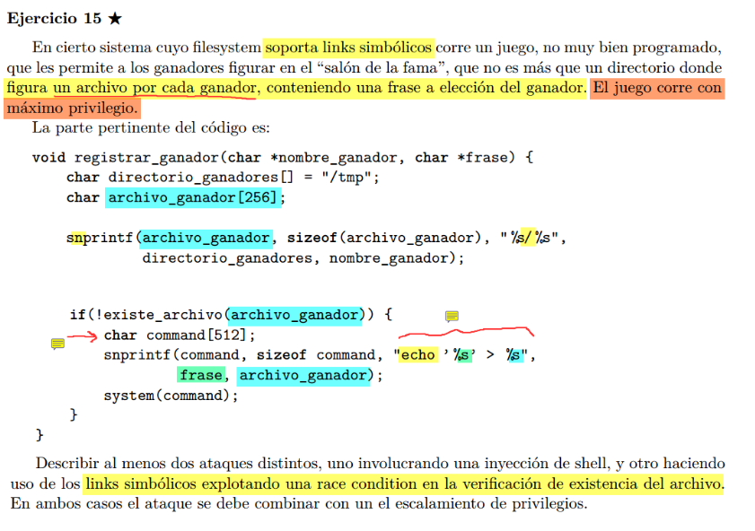

  

## shell injection 
Ya que no se sanitiza la frase que ingresa el usuario, podriamos hacer lo siguiente:  
```bash
frase = "hola";/bin/sh; echo "hackea2"
```
De esta forma, luego del echo, el sistema nos va a abrir una terminan con privilegios elevados!

## race condition  
Si justo despues de que entre en el if, tras comprobar que el archivo no existe, lograsemos de alguna forma interrumpir la ejecucion, podriamos crear un archivo (```archivo_ganador```) que sea un link simbolico a otro ```archivo sensible```... luego, al retomar la ejecucion, combinando con el shell injection, podriamos intruducir en la frase justo lo que quisieramos escribir en el archivo apuntado por el soft link.

De esta manera podriamos escribir sobre cualquier archivo, ya que el juego se ejecuta con privilegios elevados.

Quizas podriamos escribir en algun archivo como shadow o passwd para agregarnos a nosotros como root o algo asi...
