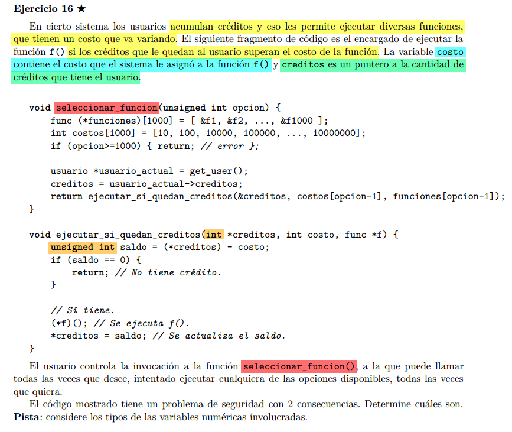

## creditos infinitos
Notemos que creditos es ```int*```, pero luego corremos:
```C
unsigned int saldo = (*creditos) - costo;
```

Si ```(*creditos) - costo``` es negativo, entonces saldo va a wrappear al maximo de su rango representable (un numero gigante).

Sabiendo esto, un usuario puede ejecutar sucesivamente varias funciones hasta que en un momento no le alcance para ejecutar otra (le da saldo negativo). Luego de intentar otra ejecucion, va a obtener muchisimo credito.