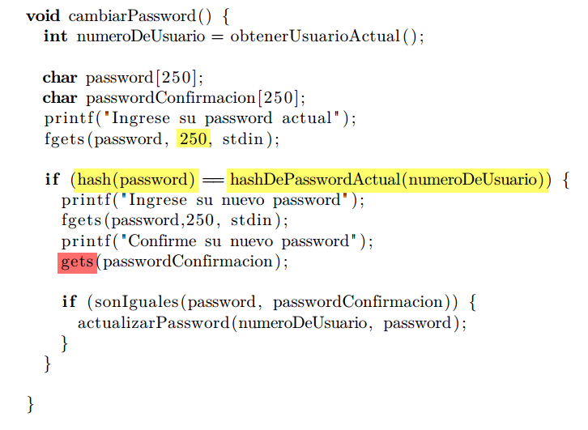
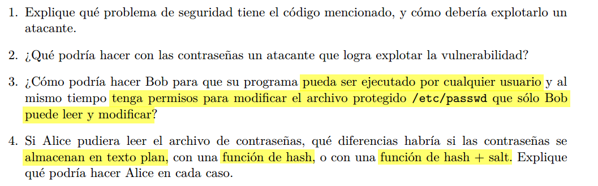
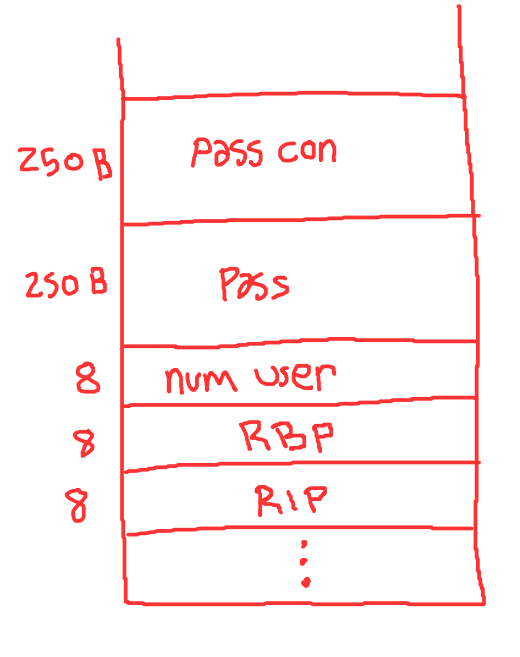

  



## 1. 2.

### Buffer overflow 
Luego de entrar en el primer if en ```cambiarPassword()```, en un momento la password de confirmacion la obtenemos del usuario con ```gets``` en vez de ```fgets``` como antes... Esto nos permite ingresar un payload (especial) que al final pise la variable temporal 
```numeroDeUsuario``` en el stack, habilitandonos a cambiarle la password a cualquier usuario arbitrario!



Notemos que la primera parte del payload no puede ser completamente basura, ya que todavia queda una verficacion mas con passwordConfirmacion. Asi que tenemos que llenar el buffer de passwordConfirmacion con data valida, luego pisamos el buffer de password con basura y finalmente en los ultimo 8 B escribimos el numero de usuario al que le querramos cambiar la password.

```bash
payload = (mi_password + padding) + AA...AA (250 veces) + numero_usuario_victima
```
## 3.  
Podria usar ```setuid()```, no sin antes asegurarse de que su programa sea seguro.


## 4.  

### texto plano:  
Perdimos, tiene todas las contraseñas directamente, no tiene que crackear nada mas.

### hash:
Si tiene solo el hash, todavia no tiene las contraseñas, puede tratar de adivinar la contraseña por fuerza bruta y ver que el hash de la contraseña adivinada coincida con el hash robado. Esto puede tomar mucho tiempo, pero hay metodos para conseguirlo, ademas, si 2 usuario comparten la misma pass, sus hashes coincidirian, por lo que se le facilita el trabajo al atacante.
El atacante podria valerse de una tabla de contraseñas frecuentes para hashearlas e ir comparando por fuerza bruta.

### hash + salt:  
Consiste en agregar un poco de "salt" (modificaciones) a la pass, antes de hashearla, esta salt es unica para cada user y se guarda junto con la pass, asi, si 2 usuarios comparten la misma pass, la salt de cada uno seria diferente, por lo que sus hashes tambien serian diferentes. Esto tambien vuelve inutiles a las tablas de contraseñas frecuentes, ya que no solo necesitariamos la contraseña, sino la ¨salt¨ que se uso para lograr que coincida con el hash robado, dificultando la tarea del atacante.


