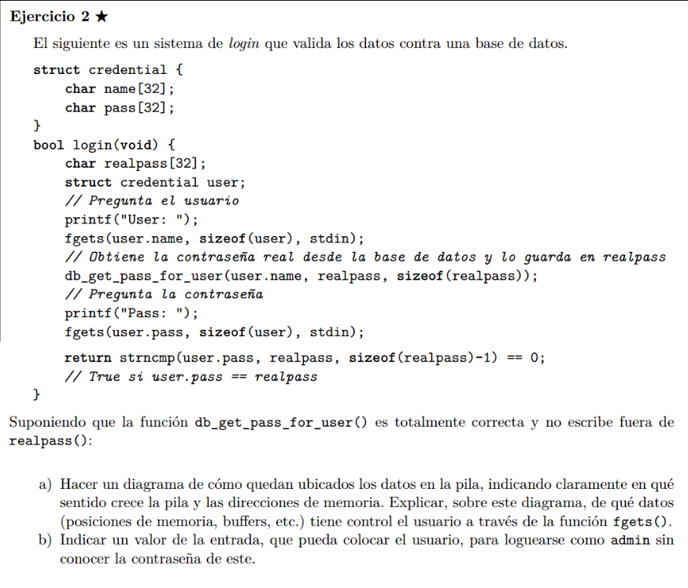
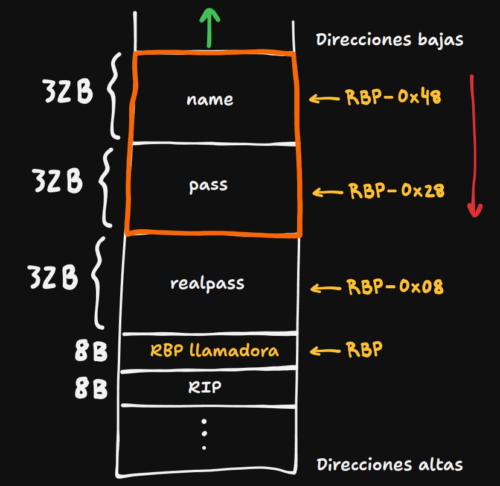

## a)



El stack crece en la direccion indicada por la flecha verde, los buffers de chars, se llenan en el sentido indicado por la flecha roja. La region naranja es la ocupada por el struct user.

Nota : los campos de un struct se pushean en stack en orden inverso en que son declarados.  

## b)

Notemos que en fgets, el codigo tiene un error fatal de seguridad. En lugar de limitar
el size del input a 32 B con ```sizeof(user.pass)``` , lo limita a 64 B que es el size del struct user entero!

Esto nos habilita a escribir un string de 64 B, los primeros 32 llenan pass, pero los ultimos 32 pisan el contenido que tenia realpass!!!
Entonces le podemos dar el valor que querramos a realpass.
Podemos por ejemplo escribir en entrada AAA .... AAA (64 veces)

Entonces tanto pass como real pass van a estar llenos de As.

Y ya que al comparar los string con ``` strncmp(user.pass, realpass, sizeof(realpass)-1) ```,
estamos limitando la cantidad de lectura a 31 (para no leer null terminating chars), no voy a tener problema de terminacion de lectura.
Para strncmp, las variables se van a ver asi:  
- pass = A...A (31 veces)  
- realpass = A...A (31 veces)


