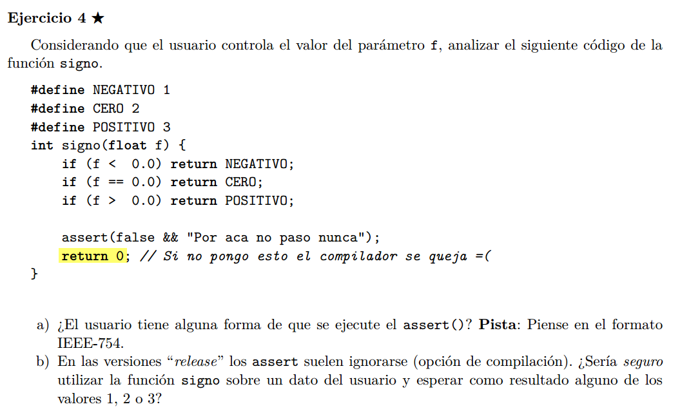

## a)
Si f vale ```Nan``` las comparaciones con este valor dan siempre false, por lo que pasaria las 3 primeras gurdas y llegaria al assert.

## b) 
No, sin los assert, si de da el caso descripto en a), la ejecucion seguiria normal y devolveriamos 0, cosa que es comportamiento no esperado.